# 连线世界：可复用的风格化组件

[← 返回项目 README](../../../README.md)

共用样式已用于博客、开源项目、教育经历、导航和页脚。三个主题会自动应用，不需要在每个新组件中重复写主题判断。

## 组件目录

- [WiredAction：层叠按钮与链接](#wiredaction)——跳转页面、外部链接、普通操作。
- [WiredBadge：风格化标签](#wiredbadge)——栏目标签、DEMO 标记、技术栈。
- [WiredAccent：层叠文字](#wiredaccent)——突出标题中的关键词。
- [WiredImage：图片占位与淡入](#wiredimage)——封面、校徽、插画和装饰图片。
- [WiredPanel：面板与辅助样式](#wiredpanel)——卡片、容器、栏目小标题、标签列表。
- [WiredProse：长文排版](#wiredprose)——博客正文、列表、引用。
- [三个主题的整体效果](#主题预览)。
- [调整局部尺寸与颜色](#调整局部尺寸)。

其中前四项是 Vue 组件；面板和正文是可以直接加到 HTML 元素上的共用 CSS 样式。截图来自现有组件在本地页面中的实际渲染，静态图片不展示悬停和焦点动效。

## 文件分工

- `src/styles/tokens.css`：全站主题、颜色、字体、字号、间距、内容宽度和动画速度。
- `src/styles/primitives.css`：按钮、标签、层叠文字、面板、容器、标签列表和正文排版的实际绘制规则。
- 当前目录的 Vue 组件：提供语义正确、可直接调用的按钮、标签和层叠文字。
- 各页面的样式：保留业务布局、专用插画和特殊动画，通过局部变量调整共用 UI 的尺寸。

两个 CSS 文件在 `App.vue` 中统一引入，新页面不用再次引入。

下方 Vue 示例按放在 `src/views/` 中编写，组件的相对导入路径应随文件所在位置调整。各组件的 `class` 会传到根元素，可以用局部 CSS 变量定制外观。

## WiredAction

**层叠按钮与链接。** 适合“阅读博客”“查看项目”“返回”等操作。源码：[WiredAction.vue](WiredAction.vue)。

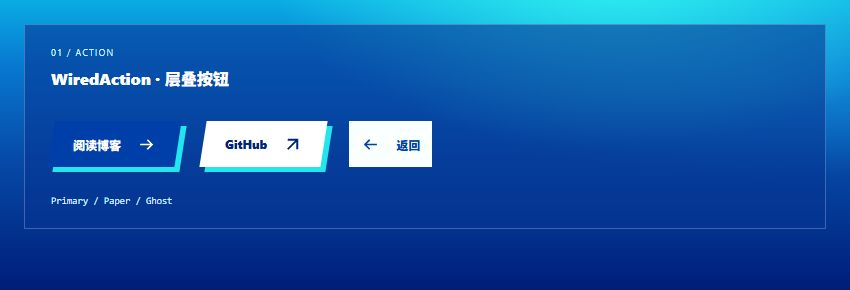

```vue
<script setup lang="ts">
import WiredAction from '../components/ui/WiredAction.vue';

function saveDraft() {
  // 在这里接入实际的草稿保存逻辑。
}
</script>

<template>
  <WiredAction to="/blog" arrow="right">阅读博客</WiredAction>
  <WiredAction href="https://github.com/Wh0rigin" variant="paper"
    arrow="up-right" target="_blank" rel="noopener noreferrer">GitHub</WiredAction>
  <WiredAction variant="ghost" arrow="left" to="/">回到主页</WiredAction>
  <WiredAction arrow="none" @click="saveDraft">保存草稿</WiredAction>
</template>
```

- `to` 渲染站内 RouterLink；`href` 渲染普通链接；两者都不传时渲染 button。一次使用一种跳转方式。
- `variant`：`primary`（主题色层叠）、`paper`（浅色层叠）、`ghost`（纯文字）。
- `arrow`：`right`、`up-right`、`left`、`none`。
- 普通按钮支持 `type` 和 `disabled`。`aria-label`、`target`、`rel`、`class` 和点击事件会传给实际元素。
- 请勿在按钮/链接内部再嵌套另一个按钮/链接。
- `ghost` 的文字颜色适合放在 `wired-panel` 等内容面板中；截图为它加了浅色展示背景，这个背景不是组件自身的效果。

**常用定制变量**：`--ui-action-padding`、`--ui-action-gap`、`--ui-action-size`、`--ui-action-offset`、`--ui-action-bg`、`--ui-action-color`、`--ui-action-layer`。

## WiredBadge

**风格化标签。** 适合栏目名称、文章类型、技术栈等短文本。源码：[WiredBadge.vue](WiredBadge.vue)。

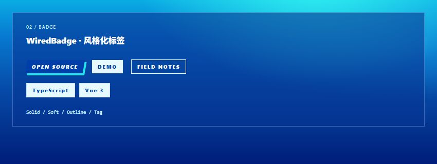

```vue
<script setup lang="ts">
import WiredBadge from '../components/ui/WiredBadge.vue';
</script>

<template>
  <WiredBadge as="p">Selected work</WiredBadge>
  <WiredBadge variant="soft" flat>DEMO</WiredBadge>
  <WiredBadge variant="outline" flat>FIELD NOTES</WiredBadge>
  <ul class="wired-tags">
    <WiredBadge as="li" variant="tag" flat>TypeScript</WiredBadge>
    <WiredBadge as="li" variant="tag" flat>Vue 3</WiredBadge>
  </ul>
</template>
```

- `as`：`span`（默认）、`p`、`li`，根据文本所在的位置选择标签；`li` 应放在 `ul` 或 `ol` 内。
- `variant`：`solid`（默认层叠色块）、`soft`（浅底）、`outline`（描边）、`tag`（技术标签）。
- `flat`：关闭阴影，默认是 `false`。
- `solid` 自动将英文字母显示为大写。

**常用定制变量**：`--ui-badge-padding`、`--ui-badge-size`、`--ui-badge-tracking`、`--ui-badge-bg`、`--ui-badge-color`、`--ui-badge-shadow`。

## WiredAccent

**层叠文字。** 适合标题中的关键词，字号继承父元素，组件负责斜切色块和层叠背景。源码：[WiredAccent.vue](WiredAccent.vue)。

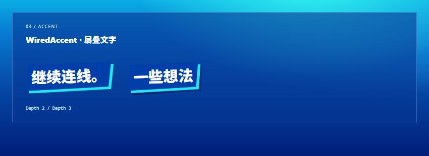

```vue
<script setup lang="ts">
import WiredAccent from '../components/ui/WiredAccent.vue';
</script>

<template>
  <h2 class="example-title">想法，<WiredAccent>继续连线。</WiredAccent></h2>
  <h2 class="example-title">代码里的 <WiredAccent :depth="3">一些想法</WiredAccent></h2>
</template>

<style scoped>
.example-title {
  font-size: clamp(1.8rem, 4vw, 3rem);
  font-weight: 900;
  line-height: 1.4;
}
</style>
```

`depth` 默认是 `2`，也可以使用 `3`。文字与背景分开绘制，装饰层不会拦截点击。

**常用定制变量**：`--ui-accent-offset`、`--ui-accent-transform`、`--ui-accent-bg`、`--ui-accent-text`、`--ui-accent-layer`、`--ui-accent-back`。

## WiredImage

**图片占位与淡入。** 图片下载并解码完成前显示主题占位画面，完成后淡入；加载失败时保留尺寸并显示“图片暂未加载”。白天采用蓝色渐变、03、青色层叠与水波圆环；黑夜采用红黑斜切拼贴、05、网点和倾斜纸片；隐藏黄色主题采用 04、电视图标和彩色条纹。源码：[WiredImage.vue](WiredImage.vue)。

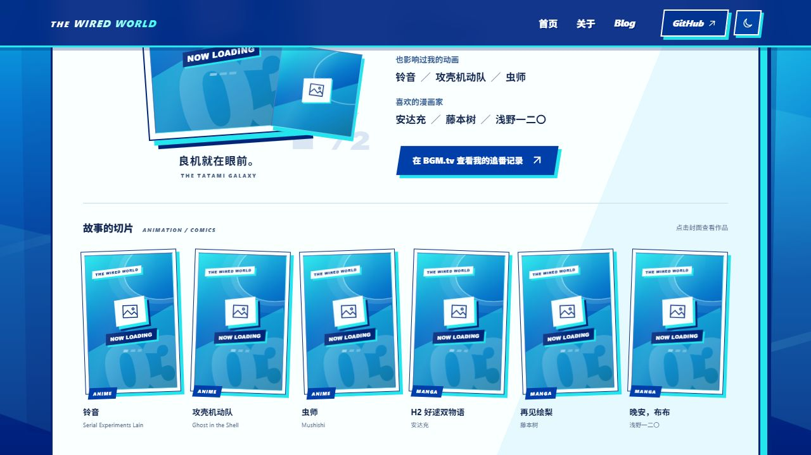

<details>
<summary>查看黑夜与黄色主题的占位设计</summary>

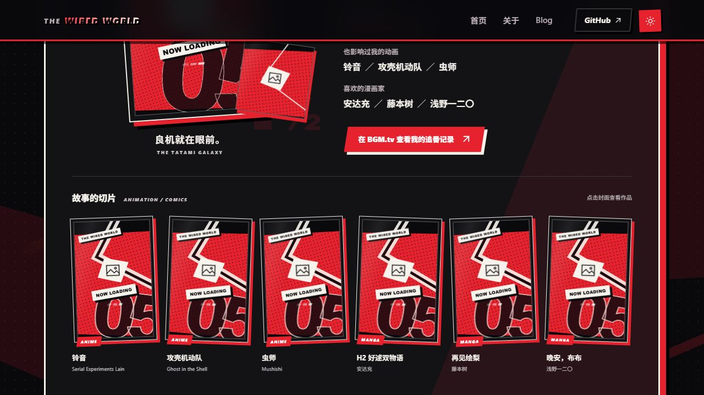

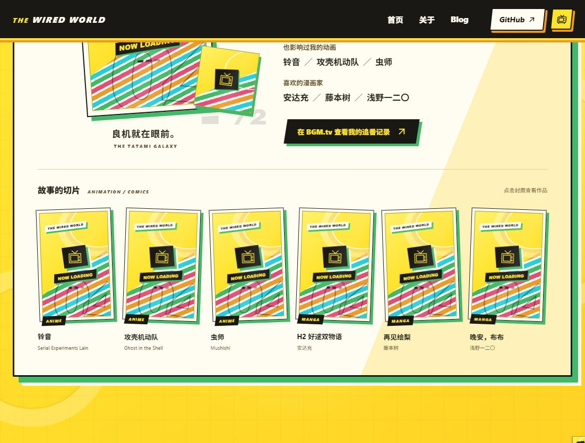

</details>

```vue
<script setup lang="ts">
import WiredImage from '../components/ui/WiredImage.vue';
</script>

<template>
  <WiredImage src="/acg/tatami-galaxy.jpg" alt="四叠半神话大系封面"
    :width="800" :height="1142" />
  <div class="square-cover">
    <WiredImage src="/music/vaundy-replica.jpg" alt="replica 专辑封面"
      :width="600" :height="600" fill />
  </div>
</template>

<style scoped>
.square-cover { width: 180px; aspect-ratio: 1; --ui-image-fit: cover; }
</style>
```

- `width` / `height` 必填，用原图尺寸预留比例，避免加载时布局跳动。
- `loading` 默认 `lazy`；首屏插画可设为 `eager`。
- `fill` 填满已有尺寸的父容器；默认按原图比例显示。用 `--ui-image-fit: cover` 调整裁切，默认 `contain`。
- `compact` 用于校徽、小装饰等，隐藏占位文字和大号数字，保留简化的主题图框。
- `keepPrevious` 用于眨眼等连续切换，下一张未准备好时保留已加载的上一张，并直接切换，避免闪烁。
- `@ready` 在当前图片下载、解码完成后给出源地址；`@error` 给出失败的源地址。缓存命中和 `src` 变化也会处理。
- `class`、`style` 和交互事件传给外层 `span`。通过 `:deep(.wired-image-content)` 定制内部图片；装饰图使用 `alt="" aria-hidden="true"`。
- 占位块自动适配三个主题，减少动态效果偏好下关闭扫光、信号条动画和淡入。

## WiredPanel

**面板与辅助样式。** 这里使用 CSS 类，不需要导入一个名为 `WiredPanel` 的 Vue 组件。样式定义在 [primitives.css](../../styles/primitives.css)。

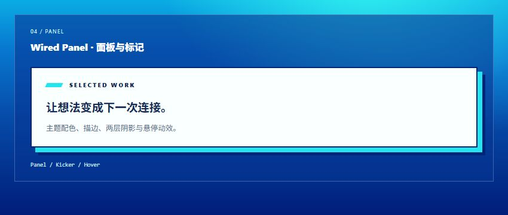

```vue
<template>
  <section class="wired-container">
    <article class="wired-panel wired-panel--interactive custom-card">
      <p class="wired-kicker">
        <span class="wired-kicker-mark" aria-hidden="true"></span> SELECTED WORK
      </p>
      <h2>让想法变成下一次连接。</h2>
      <p>这里放项目介绍或一段个人经历。</p>
    </article>
  </section>
</template>

<style scoped>
.custom-card { padding: var(--space-6); }
.custom-card h2 { margin: var(--space-4) 0; }
</style>
```

- `wired-container`：统一最大宽度与左右留白。
- `wired-panel`：主题配色、边框和两层阴影；自行设置内容的 padding。
- `wired-panel--interactive`：鼠标悬停时抬起，适合可点击卡片或现有项目卡片。
- `wired-kicker` / `wired-kicker-mark`：小标题与斜切标记。
- `wired-tags`：可换行的标签列表。
- `wired-prose`：长文的标题、段落、列表、引用及手机字号。

面板类可以直接加到 `article`、`ol` 或 `router-link` 上，不需要额外的包装节点。

使用可点击卡片时，将 `wired-panel wired-panel--interactive` 加在实际的 `router-link` 或 `a` 上，再配置 `to` 或 `href`。纯展示内容可以只使用 `wired-panel`。

**常用定制变量**：`--ui-panel-bg`、`--ui-panel-color`、`--ui-panel-border`、`--ui-panel-border-width`、`--ui-panel-shadow`、`--ui-panel-hover-shadow`。`wired-container` 的留白通过 `--ui-container-gutter` 调整。

## WiredProse

**长文排版。** 同样是 CSS 样式类，适合博客、学习笔记或较长的介绍。自动处理段落、章节标题、列表、引用和手机字号。

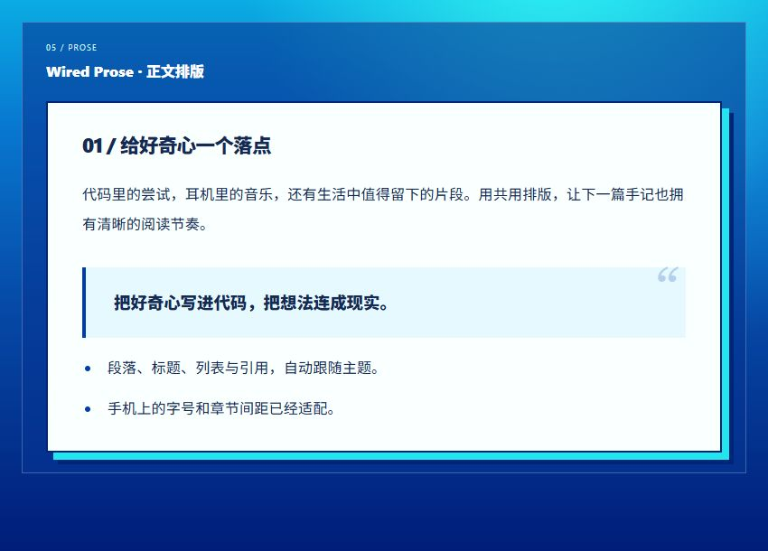

```vue
<template>
  <article class="wired-panel wired-prose custom-article">
    <section id="intro">
      <h2>01 / 给好奇心一个落点</h2>
      <p>第一段正文。</p>
      <p>第二段正文。</p>
      <blockquote><p>把好奇心写进代码，把想法连成现实。</p></blockquote>
      <ul><li>一个要点。</li><li>另一个要点。</li></ul>
    </section>
    <section id="next">
      <h2>02 / 下一次连接</h2>
      <p>相邻章节会自动留出间距。</p>
    </section>
  </article>
</template>

<style scoped>
.custom-article { padding: var(--space-8); }
@media (max-width: 680px) {
  .custom-article { padding: var(--space-6); }
}
</style>
```

正文以 `article > section` 为章节；章节标题、段落和列表应分别使用 `section` 的直接子元素 `h2`、`p`、`ul`。引言、作者信息和文章尾注可以放在 section 外，避免套用正文段落的格式。

通过 `--ui-prose-size` 和 `--ui-prose-heading` 调整正文与章节标题字号。组件已经包含手机排版规则，只有确实需要时再覆盖。

## 主题预览

所有组件共用 [tokens.css](../../styles/tokens.css) 中的语义颜色。白天以蓝色与天蓝色为主，黑夜以红黑和浅色文字为主，隐藏频道以黄色、黑色和绿色层叠为主。下面展示相同组件在三个主题中的效果。

<details>
<summary>白天主题：查看完整截图</summary>

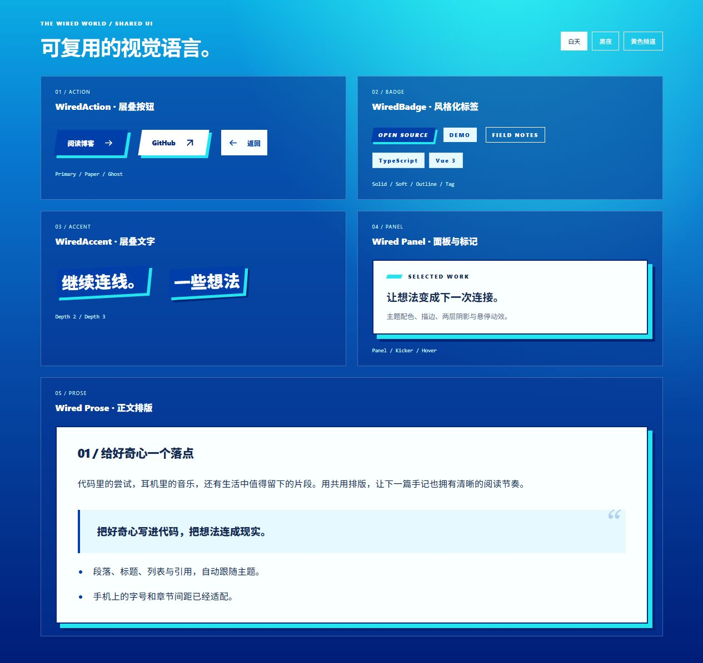

</details>

<details>
<summary>黑夜主题：查看完整截图</summary>

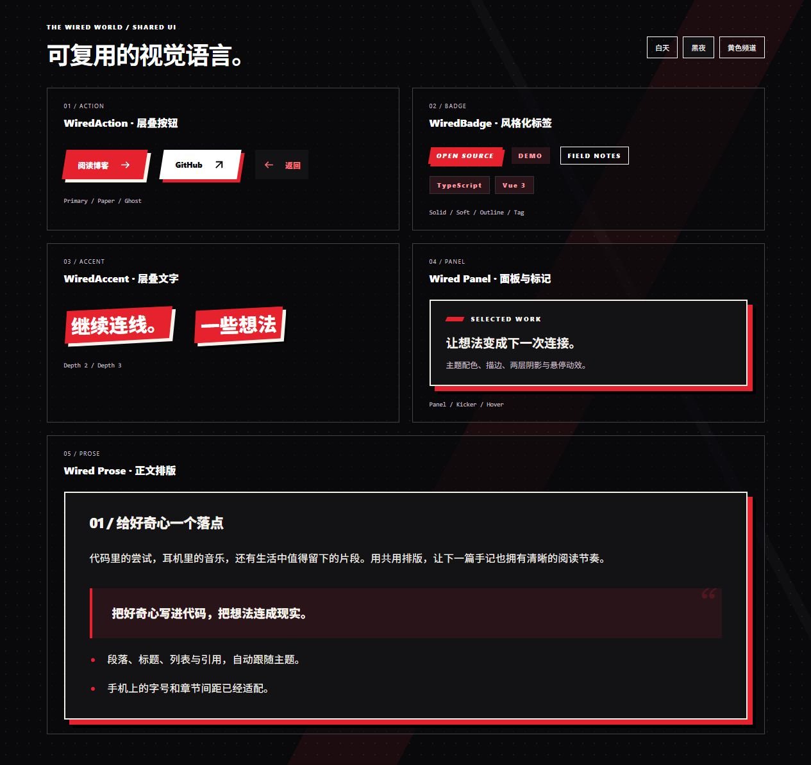

</details>

<details>
<summary>隐藏黄色主题：查看完整截图</summary>

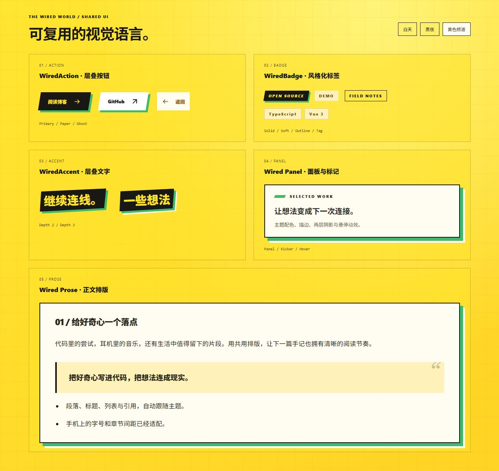

</details>

网站的主题状态由 [mode.ts](../../stores/mode.ts) 管理，并同步到根节点的 `data-theme`。新组件直接使用这些组件或 `--ui-*` 变量即可跟随主题；不用在页面中复制三套颜色判断。

## 调整局部尺寸

用 CSS 变量调整尺寸和细节，让绘制规则继续由公共样式负责：

```css
.custom-card {
  padding: var(--space-6);
  --ui-panel-shadow: 6px 6px 0 var(--ui-layer), 11px 11px 0 var(--ui-stage-shadow);
}

.compact-action {
  --ui-action-padding: 10px 14px;
  --ui-action-gap: 9px;
  --ui-action-size: .8rem;
  --ui-action-offset: 4px;
}

.custom-title {
  --ui-accent-offset: 8px;
  --ui-accent-transform: rotate(-2deg) skewX(-5deg);
}

.custom-label {
  --ui-badge-size: .7rem;
  --ui-badge-padding: 5px 10px;
}

@media (max-width: 680px) {
  .custom-page { --ui-container-gutter: 36px; }
}
```

常用全站变量：`--ui-accent`、`--ui-layer`、`--ui-paper`、`--ui-copy`、`--ui-muted`、`--ui-line`、`--ui-stage-text`、`--font-body`、`--font-display`、`--font-mono`、`--space-1` 到 `--space-8`（提供 1、2、3、4、6、8）、`--layout-content-width`、`--motion-panel`。

新增内容优先组合现有组件和样式类。需要改变整个网站的颜色、字体或动效时修改 tokens；需要改变所有层叠按钮的绘制方式时修改 primitives。人物图像、唱片、聚光灯、加载页等专用视觉继续在各自的业务组件中维护。
